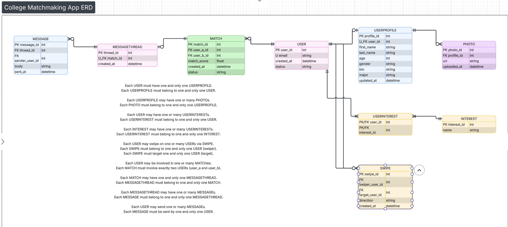

# Web-Project
html/css/javascript web project
This web project is a spin on tinder but for networking and finding students that have the same interests or courses as you.
Users should have the ability to login, then create a quick profile with a picture upload and text boxes for entering interests, courses, etc, then
Another page for displaying common people, and ultimately a match page.
Solves the age old problem of human connection- creating connections- perhaps re-connect is a cool play on words name for the project
The intended user is anyone thats lonely and has access to a device, preferably college students
Sign up, create profile, swipe on individual profiles, and connect.

ERD Business Rules: 

Each USER must have one and only one USERPROFILE.
Each USERPROFILE must belong to one and only one USER.

Each USERPROFILE may have one or many PHOTOs.
Each PHOTO must belong to one and only one USERPROFILE.

Each USER may have one or many USERINTERESTs.
Each USERINTEREST must belong to one and only one USER.

Each INTEREST may have one or many USERINTERESTs.
Each USERINTEREST must belong to one and only one INTEREST.

Each USER may swipe on one or many USERs via SWIPE.
Each SWIPE must belong to one and only one USER (swiper).
Each SWIPE must target one and only one USER (target).

Each USER may be involved in one or many MATCHes.
Each MATCH must involve exactly two USERs (user_a and user_b).

Each MATCH may have one and only one MESSAGETHREAD.
Each MESSAGETHREAD must belong to one and only one MATCH.

Each MESSAGETHREAD may have one or many MESSAGEs.
Each MESSAGE must belong to one and only one MESSAGETHREAD.

Each USER may send one or many MESSAGEs.
Each MESSAGE must be sent by one and only one USER.